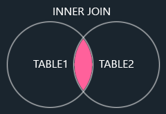
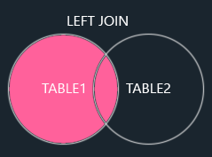
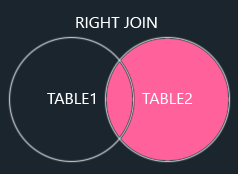
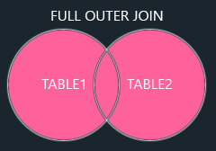

# SQL Joins

A `JOIN` clause is used to combine rows from two or more tables, based on a related column between them.

Let's look at a selection from the Northwinds `Orders` table:
| OrderID | CustomerID | OrderDate |
| - | - | - |
| 10308 | 2 | 1996-09-18 |
| 10309 | 37 | 1996-09-19 |
| 10310 | 77 | 1996-09-20 |

Then, look at a selection from the `Customers` table:

| CustomerID | CustomerName                       | ContactName    | Country |
| ---------- | ---------------------------------- | -------------- | ------- |
| 1          | Alfreds Futterkiste                | Maria Anders   | Germany |
| 2          | Ana Trujillo Emparedados y helados | Ana Trujillo   | Mexico  |
| 3          | Antonio Moreno Taquería            | Antonio Moreno | Mexico  |

Notice that the `CustomerID` column in the `Orders` table refers to the `CustomerID` in the `Customers` table. The relationship between the two tables above is the `CustomerID` column.

Then, we can create the following SQL statement (that contains an `INNER JOIN`), that selects records that have matching values in both tables:

```sql
SELECT Orders.OrderID, Customers.CustomerName, Orders.OrderDate
FROM Orders
INNER JOIN Customers ON Orders.CustomerID=Customers.CustomerID;
```

and it will produce something like this:

| OrderID | CustomerName                       | OrderDate  |
| ------- | ---------------------------------- | ---------- |
| 10308   | Ana Trujillo Emparedados y helados | 9/18/1996  |
| 10365   | Antonio Moreno Taquería            | 11/27/1996 |
| 10383   | Around the Horn                    | 12/16/1996 |
| 10355   | Around the Horn                    | 11/15/1996 |
| 10278   | Berglunds snabbköp                 | 8/12/1996  |

### (INNER) JOIN



`(INNER) JOIN` Returns records that have matching values in both tables.

> **Note**: The `INNER JOIN` keyword returns only rows with a match in both tables.

### LEFT (OUTER) JOIN



`LEFT (OUTER) JOIN` Returns all records from the left table, and the matched records from the right table.

> **Note**: The `LEFT JOIN` keyword returns all records from the left table, even if there are no matches in the right table.

### RIGHT (OUTER) JOIN



`RIGHT (OUTER) JOIN` Returns all records from the right table, and the matched records from the left table.

> **Note**: The `RIGHT JOIN` keyword returns all records from the right table, even if there are no matches in the left table.

### FULL (OUTER) JOIN



`FULL (OUTER) JOIN` Returns all records when there is a match in either left or right table.

> **Note**: The `FULL OUTER JOIN` keyword returns all matching records from both tables whether the other table matches or not.
